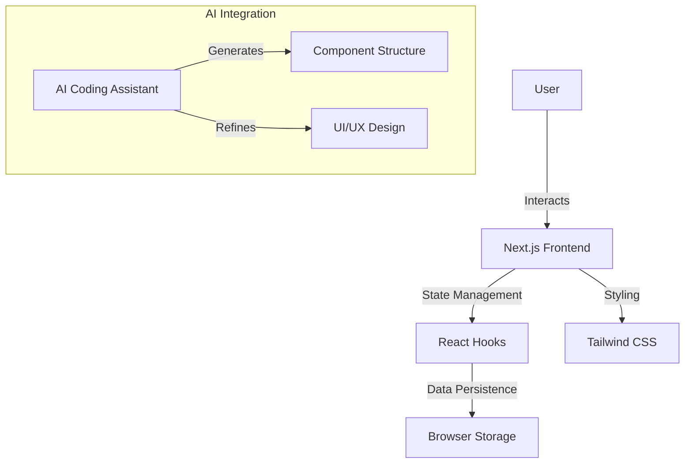

# Virtual Wardrobe - Vibe Coding Hackathon Submission

A next-generation, AI-driven web application for managing and organizing your personal clothing collection with style. 

> **Hackathon Submission**: Vibecraft Vibe Coding Hackathon
> **Theme**: AI-Driven Utility & Design

## 📄 Problem Statement
In the fast-paced modern world, "decision fatigue" is real, especially when choosing what to wear. People own more clothes than ever but struggle to:
1.  **Remember what they own**: Clothes get buried in the back of the closet.
2.  **Coordinate outfits**: Matching items requires visualization which is hard to do mentally.
3.  **Track usage**: Knowing what you wear most/least helps in sustainable fashion choices.

**Virtual Wardrobe** solves this by digitizing your closet, allowing for easy organization, outfit planning, and eventually AI-powered outfit recommendations.

## 🏗️ System Architecture



## 🛠️ Tech Stack

### Core
- **Framework**: Next.js 15.2.4 (App Router)
- **Language**: TypeScript 5
- **Styling**: Tailwind CSS 3.4.17
- **UI Components**: Radix UI / Shadcn UI
- **Icons**: Lucide React
- **Charts**: Recharts
- **Validation**: Zod + React Hook Form

### AI Tools Used
- **Google DeepMind Antigravity**: Used for full-stack code generation, debugging, and project structuring.
- **LLM Prompting**: Utilized for generating semantic HTML and accessible UI components.
- **v0.dev** (Inferred from project name `my-v0-project`): Initial scaffolding.

## 🤖 Prompt Strategy Summary
We employed a **Component-Driven AI Development** strategy:
1.  **Context Setting**: Defined the "Vibe" (Premium, Dark Mode, Sleek) initially.
2.  **Atomic Generation**: Prompted for individual components (Cards, Buttons) to ensure isolation and reusability.
3.  **Iterative Refinement**: Used feedback loops to polish the UI, specifically requesting "rich aesthetics" and "smooth interactions".
*See `PROMPTS.md` for detailed prompt history.*

## 📦 Project Structure

```
virtual-wardrobe-main/
├── PROMPTS.md               # Prompt logs and templates
├── README.md                # Documentation (You are here)
├── SOCIAL_MEDIA_POST.md     # Drafts for Community Choice Award
├── screenshots/             # Final Output (Screenshots)
└── web-app/                 # Source Code (Next.js Application)
    ├── app/                 # Next.js app directory
    ├── components/          # Reusable React components
    ├── hooks/               # Custom React hooks
    └── lib/                 # Utility functions
```

## 🌐 Deployment (Live Demo)
**[INSERT_DEPLOYED_LINK_HERE]** (e.g., Vercel, Netlify)

## 🚀 Build Reproducibility Instructions (Mandatory)

**Judges: Follow these exact steps to run the project locally.**

1.  **Clone/Download the Repository**
    Ensure you are in the root directory `Virtual-Wardrobe-main`.

2.  **Navigate to the Source Directory**
    ```bash
    cd web-app
    ```

3.  **Install Dependencies**
    We use `pnpm` (or `npm`).
    ```bash
    npm install
    # OR
    pnpm install
    ```

4.  **Start the Development Server**
    ```bash
    npm run dev
    # OR
    pnpm dev
    ```

5.  **Access the Application**
    Open your browser and visit: [http://localhost:3000](http://localhost:3000)

## 🎥 Demo
(Link to 3-Minute Demo Video to be added here)

## 📱 Features
- **Digital Closer**: Add, edit, and view details of clothing items.
- **Category Filtering**: Sort by Tops, Bottoms, Shoes, etc.
- **Outfit Planner**: Combine items to see how they look together.
- **Responsive Design**: Works on Desktop and Mobile.
