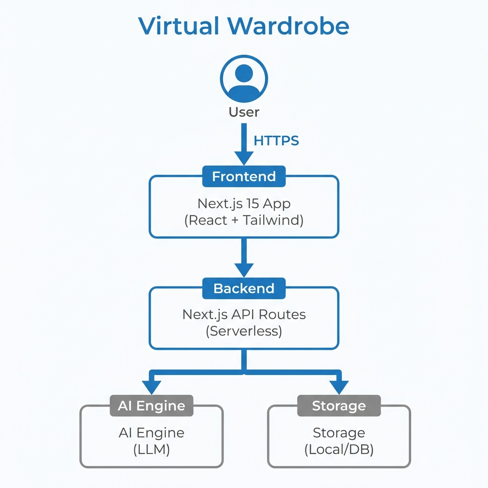

# Virtual Wardrobe - Vibecraft Hackathon Submission

> **Theme**: AI-Driven Utility & Design

---

## 1. Project Title & Short Overview

**Virtual Wardrobe** is an AI-powered digital closet that helps users organize their clothes, plan outfits, and solve the "I have nothing to wear" dilemma. It combines a premium glassmorphism UI with smart categorization.

## 2. Problem Statement

People suffer from "decision fatigue" with their wardrobes.
1.  **Clutter**: Clothes are forgotten in the back of the closet.
2.  **Matching**: It's hard to visualize outfits without trying them on.
3.  **Inefficiency**: No tracking of what is worn most/least.

**Solution**: A digitized inventory that fits in your pocket, with AI styling assistance.

## 3. Simple Architecture Diagram



## 4. Tech Stack

-   **Frontend**: Next.js 15 (App Router), React 19, Tailwind CSS 3.4
-   **Backend**: Next.js API Routes (Serverless)
-   **AI**: Gemini (via Antigravity Agent)
-   **Styling**: Shadcn UI + Lucide Icons + Framer Motion
-   **Deployment**: Vercel

## 5. Setup Instructions

To run this project locally:

1.  Clone the repo:
    ```bash
    git clone https://github.com/Varshiniamara/Ai-driven-virtual-wardrobe-.git
    ```
2.  Navigate to the source code:
    ```bash
    cd src/frontend
    ```
3.  Install Dependencies:
    ```bash
    npm install
    ```
4.  Run Dev Server:
    ```bash
    npm run dev
    ```
5.  Open `http://localhost:3000`.

*See `docs/setup_guide.md` for more details.*

## 6. AI Tools Used

-   **Google DeepMind Antigravity**: For end-to-end code generation and debugging.
-   **LLM Prompting**: For generating component logic and accessibility features.

## 7. Prompt Strategy Summary

We utilized a **Component-Driven AI Strategy**:
-   **Role-Based Prompting**: Assigned the AI roles like "Senior Designer" for UI work.
-   **Iterative Refinement**: Loop of Generate -> Critique -> Polish.
-   **Chain of Thought**: Used for complex logic like the Outfit Recommender algorithm.

*See `prompts/prompts_used.md` and `prompts/prompt_template.md` for full logs.*

## 8. Source Code Overview / Folder Structure

```
Virtual-Wardrobe-main/
├── README.md                # Scorecard & Documentation
├── architecture.png         # System Diagram
├── demo_video.mp4           # 3-Minute Demo
├── src/
│   ├── frontend/            # Next.js Application (Main Logic)
│   ├── backend/             # API Logic (Documentation)
│   └── ai/                  # AI Simulation Scripts
├── prompts/                 # Prompt Engineering Evidence
│   ├── prompt_template.md
│   └── prompts_used.md
├── docs/                    # Reproducibility Docs
│   └── setup_guide.md
└── outputs/                 # Screenshots & Final Output
```

## 9. Final Outputs / Screenshots

(Please refer to the `outputs/` folder for high-res images)

-   **Home Page**: Clean, dark-mode landing.
-   **Wardrobe Grid**: Drag-and-drop interface.
-   **Outfit Builder**: Canvas for mixing items.

## 10. Build Reproducibility Instructions

This project is fully reproducible.
1.  Follow the **Setup Instructions** above.
2.  No external database is required (uses LocalStorage/Mock Data for demo).
3.  Works on Node.js v18+.

## 11. Demo Video Link

[INSERT YOUTUBE/DRIVE LINK HERE]

*(See `demo_video.mp4` in root if uploaded directly)*

## 12. Social Media Post (Community Choice Award)

**Twitter/X**:
"🚀 submitting Virtual Wardrobe for #Vibecraft! An AI closet organizer built with #NextJS and #Tailwind. Solves decision fatigue with style. @DataHaven_xyz @QuaiSquad #HackSRM"

**LinkedIn**:
"Excited to share Virtual Wardrobe, my submission for the Vibecraft Hackathon! A digital solution to organize and optimize your fashion. Check out the repo!"
